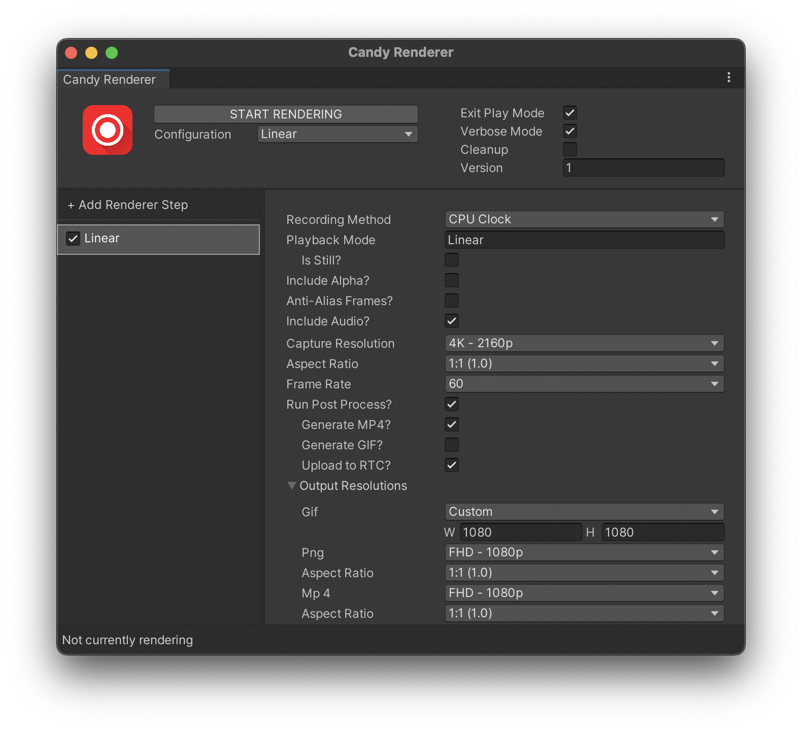

# Michael Cole Code Sample for Second Dinner

These code files are parts of the larger system I built at Candy Digital for rendering out static media. Candy Digital makes collectibles in Unity that are sold as NFTs. Since a user may be unable to view the Unity player in their browser or may be viewing their NFT outside of Candy Digital's platform there must be some form of static image or video for every collectible. During my time at Candy Digital, I re-wrote their mechanism for rendering out these pieces of media to achieve a precise repeatable result that was highly configurable and able to run both from a user's machine via a GUI and via the command line.

The previous rendering system was manipulating Unity’s time scale to render frames and was not accurate because depending on the amount of time it takes to write a frame to disk it could drop frames. It’s also difficult to render videos because Unity’s video player doesn’t support changes to the time scale. The Unity Recorder while faster than the old method was also not viable because it too manipulates the time scale as it records. The Unity Recorder uses asynchronous GPU readback to render frames, which is faster than the previous rendering system, but still introduces hiccups when converting a frame's render texture into a texture before writing it to disk.My new system excerpted in this repo (mainly in `GenlockRecorder.cs`) borrows a technique from video synchronization, namely genlock. It uses a coroutine that utilizes the CPU clock to precisely control the frame rate of the editor. The two methods I mentioned before needed to slow down the time scale to allow for recording and writing the frame to disk. Instead, this new method caches the frames in memory by simply taking over the currently rendering camera and rendering to a new render texture every frame. The main coroutine renders a frame, calculates precisely when the next frame should render, and then makes the main thread sleep until the next frame should be rendered.

As a consequence of this implementation, the editor is now holding many frames in memory so it is possible to run out of RAM. This is where `GenlockMemoryManager.cs` comes in. `GenlockMemoryManager` executes an editor coroutine checking to see how many frames are currently in memory. Once the number reaches some configurable threshold it pauses the editor, and by extension the genlock routine, and then flushes the frames currently in memory to disk to free up space. Since this is an editor coroutine and not a normal one, it has to be a separate file. 

With all of that logic, there is still the problem of video playback. It also just so happens that this offline render is invoked via the command line on AWS EC2 Linux machines so most videos wouldn’t playback through the standard video player anyway given that only a small subset of codecs are supported by Unity on Linux. So I wrote a preprocessor (that is not included in these files) that uses ffmpeg to split any videos into individual frames and the audio stream. I then wrote a script that wraps the Unity video player and depending on whether an offline render is active will load the frames individually or use the built-in Unity video player. This way I could precisely control which frame is visible as the offline renderer is running. You can see this in the references to `VideoRenderer` in `GenlockRecorder`.

I have also included `CandyRendererWindow.cs` which is the code for the main UI I made for using the renderer locally. Normally this renderer is invoked via the command line, but in the instances when a user wishes to render locally they could use this special interface. The UI is inspired by Unity's built-in recorder UI. This window communicates with a server that stores the render configurations for a given collectible. It then allows the user to modify the configuration before starting the rendering process.

